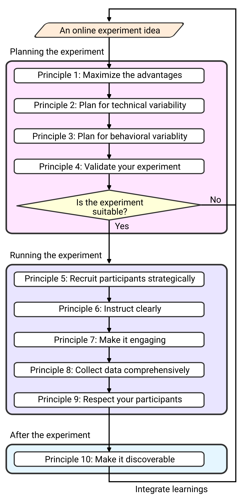

# Introduction {.unnumbered}

Careful behavioral observations can reveal the intricate workings of the human mind [@krakauerNeuroscienceNeedsBehavior2017; @nivPrimacyBehavioralResearch2021]. For example, how vigorously we move betrays our preferences: we walk more briskly when meeting a close friend and drag our feet when heading to an unwelcome appointment [@shadmehrMovementVigorReflection2019]. Similarly, our behavior reflects our confidence: we might decisively grab our favorite drink at a breakfast buffet but tentatively hover between the different pastry options [@dotanOnlineConfidenceMonitoring2018].

For much of its history, behavioral research has been conducted in the laboratory setting, where strict oversight ensures consistency. Such experimental control ensures that the studied behaviors are not confounded by environmental factors, for example, by minimizing variability from external distractions that might otherwise alter participants' responses. Moreover, in-lab testing grants access to specialized, often costly equipment – such as robotic manipulanda that can passively move the arm or apply perturbing forces – allowing researchers to precisely manipulate and measure behavior that would be difficult to capture otherwise.

However, laboratory experiments have notable limitations. They are time-intensive, typically allowing only a few participants to be tested at once, often leading to small, underpowered samples collected over restricted timeframes [@szucsEmpiricalAssessmentPublished2017]. As a result, findings can be difficult to replicate [@cohenStatisticalPowerAbnormalsocial1962; @marekReproducibleBrainwideAssociation2022; @opensciencecollaborationEstimatingReproducibilityPsychological2015]. Furthermore, laboratory studies often involve a homogeneous group of participants, for example ‘WEIRD’ individuals [@henrichWeirdestPeopleWorld2010] or undergraduate students [@arnettNeglected95Why2008], which may limit the extent to which research findings generalize to the broader population [@gordonScienceSophomoreRevisited1986; @henrichWeirdestPeopleWorld2010].

Behavioral researchers are increasingly moving their studies beyond the confines of the laboratory [@valletCanCognitiveNeuroscience2023]. One way to do so is through field-based experiments, testing participants in classrooms, clinics, workplaces, or other real-world settings [e.g., @banerjeeChildrensArithmeticSkills2025; @cullenChoosingLearnImportance2024]. Another way is crowdsourcing, the practice of recruiting large and diverse groups of individuals, which offers a compelling means of scaling behavioral research. By harnessing distributed participants, crowdsourcing overcomes many of the limitations of traditional in-person testing.

Crowdsourcing comes in many flavors. Some researchers leverage opportunity sampling at science fairs or museum exhibitions, combining the rigor of in-person testing with access to broader demographics [@clodeEvaluatingInitialUsability2024; @dasMicroofflineGainsNot2025; @ruitenbergDevelopmentalAgeDifferences2023; @turnerDevelopmentalChangesIndividual2023]. However, the biggest boom in crowdsourced research has been the use of online experiments, where participants complete experiments remotely, using personal devices such as computers [@reipsWebExperimentalPsychology2001], phones [@coutrotGlobalDeterminantsNavigation2018], or virtual reality headsets [@cesanekOuvraiOpensAccess2024].

What are the advantages of online behavioral experiments? Unlike in-person studies, online experiments can be accessed by many individuals simultaneously, significantly reducing the time required for data collection [@reipsWebExperimentMethod2000]. Additionally, this efficiency allows researchers to tackle questions that would be impractical or prohibitively resource-intensive for traditional lab settings – for example, investigating how a given psychological function varies continuously with age, rather than relying on categorical comparisons between ‘younger’ and ‘older’ groups [@hartshorneWhenDoesCognitive2015; @spiersExplainingWorldWideVariation2023; @tsayLargescaleCitizenScience2024]. Not to mention that the large sample sizes provide greater statistical power to detect meaningful behavioral effects and monitor changes over time, thereby enhancing the likelihood of replicable findings [@johnsonCrowdsourcingCognitiveSystems2022].

If a central goal of behavioral research is to uncover human universals, then crowdsourcing offers a powerful advantage: access to a more diverse and representative sample than is typically available in laboratory settings [@caslerSeparateEqualComparison2013; @goslingWiredNotWEIRD2010; @hartshorneThousandStudiesPrice2019; @smithConvenientSolutionUsing2015]. That is, researchers can use online crowdsourcing to chart the hidden landscape of perceptual, cognitive, and motor diversity in the population. Together, these advantages have established online experiments as a staple in the modern researcher's toolbox, enabling unprecedented insights into human behavior across a wide range of subfields.

However, online experiments come with notable trade-offs – most prominently, the loss of experimental control. First, researchers sacrifice some control over hardware, since participants typically use their own devices, introducing variability in stimulus presentation times, response times, and the peripherals used to make responses [@bridgesTimingMegastudyComparing2020]. When not appropriately handled, these factors may introduce misleading or spurious correlations [@pronkMentalChronometryPocket2020]. Second, researchers sacrifice some control over their participants. It is often difficult to know whether participants understand the instructions and/or remain engaged throughout the task, and if unaddressed, these issues can compromise data quality and yield misleading conclusions.

## Ten principles for crowdsourcing behavioral experiments online

To tackle these challenges, we present a beginner-friendly, practical guide to conducting high-quality crowdsourced behavioral experiments online ([@fig-principles]). Rather than focusing on implementation details, we distil ten principles that provide a structured framework for optimizing online study design, evaluating data quality, and mitigating common pitfalls. Each principle is grounded in concrete examples from crowdsourced motor control and learning studies, a domain that places stringent demands on experimental control and behavioral measurement. Demonstrating success under these conditions establishes both the feasibility and broad applicability of the ten principles across behavioral domains and crowdsourcing platforms.

```{r fig-principles}
#| fig.align: "center"
#| echo: false
#| fig-cap: "Ten principles for crowdsourcing behavioral experiments."
#| out.width: 50%



```