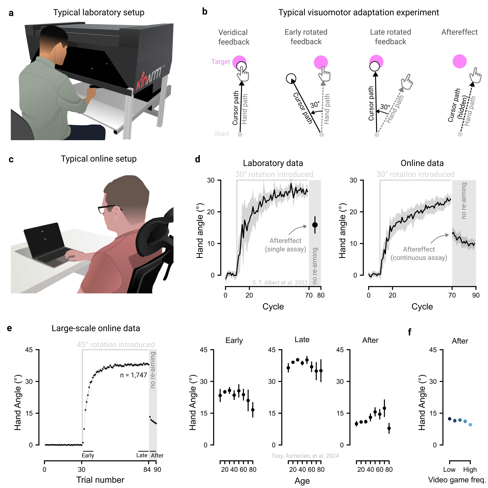

# Maximize the advantages of online crowdsourcing {#sec-princ-one}

The convenience of online testing offers many advantages for both researchers and participants. It not only accelerates data collection but also enables experiments to be run concurrently at a scale rarely achievable in the lab. Moreover, online platforms make it possible to recruit populations that are less easily accessible in traditional lab-based research.

## Advantage 1: Designs with many participants

Ready access to crowdsourced samples that can be tested in parallel can enable experiments to be conducted on an unprecedented scale [@reipsWebBasedResearchPsychology2021]. Such large-scale studies offer many unique opportunities: they provide robust evidence for small effects [@tsayLargescaleCitizenScience2024]; allow multiple moderating variables to be tested concurrently [@coutrotGlobalDeterminantsNavigation2018]; and enable researchers to assess how broadly effects generalize across diverse groups [@liuLanguageExperiencePredicts2023].

Concurrent participation introduces a powerful invariance to study design: recruiting 200 participants to each complete 20 conditions requires no more effort than recruiting 20 participants to complete 200 conditions each. This “many-participants few-trials” design, impractical in the lab, enables researchers to test generalizability across massive stimulus sets, such as evaluating a host of decision-making models on 10,000 risky gambles [@petersonUsingLargescaleExperiments2021] or assessing typing ability across 1,500 sentences [@dhakalObservationsTyping1362018]. Similar designs have also transformed robotics research: for example, the ROBOTURK platform crowdsourced over 2,200 high-quality teleoperated demonstrations in just 22 hours, generating more than 100 hours of data for optimizing surgical procedures [@mandlekarRoboTurkCrowdsourcingPlatform2018].

## Advantage 2: Designs with many timepoints

Online crowdsourcing is particularly well-suited for longitudinal studies. Large cohorts can be readily recruited for multi-session participation, and retention rates often rival, or even surpass, those of traditional studies lasting months or years [@kotheRetentionParticipantsRecruited2019]. For example, a recent study tracked first-person shooter performance across 100 days of practice [@listmanLongTermMotorLearning2021], far exceeding the typical 5-day span of in-lab skill learning studies [e.g., @shmuelofHowMotorSkill2012].

## Advantage 3: Designs with specific populations

Online recruitment makes it possible to access specific, hard to reach demographics that are often difficult to recruit, or even unattainable, through traditional in-lab methods [@smithConvenientSolutionUsing2015]. Many participant pools and citizen science approaches enable selective recruitment by demographics, making it straightforward to target specific populations, for example, video game players [@hydeFirstPersonShooterExpertise2025], left-handed individuals, or individuals reporting neuropsychiatric symptoms [@atkinsonAbilityDirectAttention2025; @barackAttentionDeficitsLinked2024]. Additionally, online testing makes it convenient to recruit rare patient groups and find closely-matched controls [@tsayMinimalImpactChronic2024; @tsayCerebellarDegenerationImpairs2023]. Remote testing can also reach infant populations that are logistically difficult to bring into the lab [@razAsynchronousHandsoffWorkflow2024].

## The principle in action

Motor adaptation, the process of correcting movement errors in response to changes in the body (e.g., muscle fatigue) and environment (e.g., a new ping-pong paddle), is typically studied in controlled laboratory settings using specialized equipment, such as robotic manipulanda ([@fig-principle-one]a). In a typical visuomotor adaptation experiment, participants are asked to use their hand to control an on-screen cursor and to use it to reach towards a target ([@fig-principle-one]b). After some period of time with veridical feedback, a visuomotor rotation (e.g., 45°) is introduced between the hand and cursor movements. Participants adjust by changing their hand’s movement angle in the opposite direction of the rotation, gradually aligning the cursor with the target, a process driven by both implicit and explicit motor learning processes.

Motor learning researchers are often interested in isolating different components of learning. For example, to isolate implicit processes underlying motor adaptation, participants are instructed to forgo their re-aiming strategy and reach straight to the target. Yet, participants often continue to move in an adapted manner (e.g., reaching \~15° clockwise of their intended movement direction). This residual ‘aftereffect’, a measure of implicit motor adaptation, indicates that the sensorimotor map has been recalibrated outside of conscious awareness [@doyaComplementaryRolesBasal2000; @kimPsychologyReachingAction2021; @krakauerMotorLearning2019; @shadmehrComputationalNeuroanatomyMotor2008; @wolpertPrinciplesSensorimotorLearning2011].

However, motor learning studies typically involve small, homogenous samples, raising concerns about the robustness and generalizability of findings beyond the laboratory. To overcome these limitations, many laboratories have recently turned to online crowdsourcing to complement traditional laboratory testing [@albertCompetitionParallelSensorimotor2022; @barradasTheoreticalLimitsSpeed2024; @cesanekMotorMemoriesObject2021; @coltmanSensitivityErrorVisuomotor2021; @kimMotorLearningMovement2022; @shyrCaseStudyValidity2024; @wangAdvancedFeedbackEnhances2024; @warburtonVisuomotorMemoryNot2025; @watralComparingMouseTrackpad2023; @weightmanResidualErrorsVisuomotor2022]. These online tasks are designed to be simple and intuitive, involving standard software (e.g., Google Chrome) and hardware (e.g., the participant’s own trackpad or computer mouse; [@fig-principle-one]c). Reassuringly, data collected online has a strong resemblance to data collected in the laboratory ([@fig-principle-one]d; @albertCompetitionParallelSensorimotor2022).

Furthermore, the expansive sample sizes in web-based studies can enable us to chip away at longstanding controversies in motor learning literature [@tsayLargescaleCitizenScience2024]. For example, lab-based studies with smaller samples have produced mixed findings on the effects of aging – some report preserved motor adaptation, others declines, and still others enhancements (see meta-analysis in @cisnerosDifferentialAgingEffects2024). In contrast, large-scale web-based datasets (n \> 1500) reveal a clearer pattern: an inverted-U relationship between age and both early and late adaptation, peaking between ages 35 and 45, along with increased aftereffects in older adults ([@fig-principle-one]e). As such, studies that sample different segments of the same inverted-U curve can yield seemingly contradictory results.

Moreover, web-based approaches have uncovered previously unrecognized constraints on motor adaptation, showing that factors often ignored in lab studies – such as gaming habits, computer use, and motivation – can meaningfully shape learning ([@fig-principle-one]f). Together, these crowdsourced findings reveal the hidden landscape of sensorimotor diversity and open new avenues for future research in this domain.

```{r fig-principle-one}
#| fig.align: "center"
#| echo: false
#| fig-cap: "Online crowdsourcing replicates in-lab findings and uncovers novel behavioral patterns. (a) Example of a typical laboratory setup for studying motor control and learning. (b) Key phases of a visuomotor adaptation task: During the baseline phase, participants use a manipulandum to reach a visual target, receiving veridical cursor feedback that aligns precisely with the direction of their movement. In the rotation phase, a visuomotor rotation (e.g., 30°) is introduced between input (hand) movement and the visual cursor's movement. Over time, participants adjust their movements to compensate for the rotation, re-aligning the cursor with the target. When the rotation is removed, participants are instructed to aim directly at the target, foregoing any re-aiming strategy. A residual ‘aftereffect’ typically emerges, providing evidence that implicit motor adaptation has taken place. (c) Example of a typical online setup. (d) Data from a standard visuomotor adaptation task are similar between in-lab and online experiments. Data from @albertCompetitionParallelSensorimotor2022. (e) A large-scale online experiment reveals an inverted-U effect of age across early adaptation, late adaptation, and aftereffect phases and uncovers (f) novel constraints of implicit adaptation, for example, with aftereffects varying with the frequency with which participants play video games. Data in (e-f) from @tsayLargescaleCitizenScience2024. Hereafter, unless stated otherwise, hollow points show participant averages, solid points, solid lines, or bars show group averages, and error bars and shaded regions show 95% confidence intervals."
#| out.width: 100%


```
