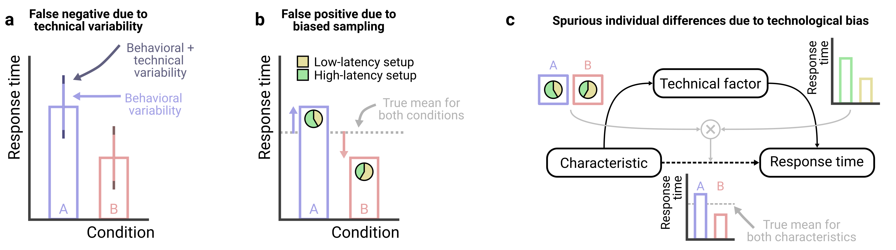
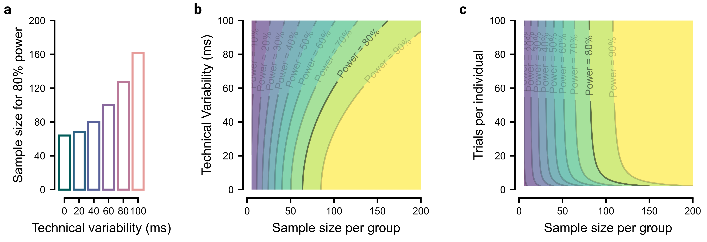
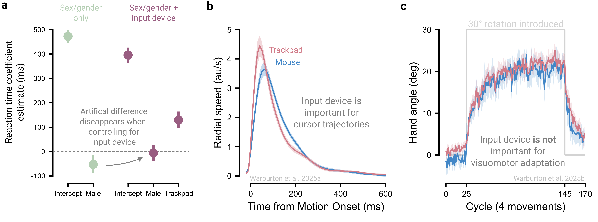

# Plan for technical variability {#sec-princ-two}

A primary concern with online crowdsourcing is the variability participants’ hardware and software. Computers may differ in screen size and resolution, and input devices can range from mice to trackballs to trackpads, each with different characteristics. Although these factors may appear trivial, they can sometimes compromise the ability to address key research questions [@germineDigitalNeuropsychologyChallenges2019]. Below, we outline strategies to account for variability in software and hardware through experimental design and data analysis.

## Combat technical variability through experiment design

Modern computing systems exhibit variability both within a single setup and across different setups. Within a given setup, response times measured via key presses can vary by roughly 30 ms (SDstandard deviation). Across setups, differences in operating systems and browsers can shift mean response times by as much as 80 ms [@anwyl-irvineRealisticPrecisionAccuracy2021; @bridgesTimingMegastudyComparing2020]. Hardware differences can further exacerbate behavioral variability, with reaction times differing by 70 ms across different touchscreen devices [@schatzValidatingAccuracyReaction2015] and by 130 ms between mouse and trackpad inputs [@warburtonInputDeviceMatters2025; @watralComparingMouseTrackpad2023].

To mitigate technical variability, we recommend the use of within-subject experimental designs where possible. This approach effectively controls for both within- and between-setup variability, since setup-specific noise would evenly impact all conditions.

However, when within-subject designs are infeasible and between-subject designs are required, it becomes especially important to understand the two keys ways in which technical variability can undermine data quality: first, technological variability adds variability around group means and thus reduces statistical power to detect effects of interest ([@fig-technical-variability]a); and second, if random participant assignment fails to balance technical variables across conditions, between-subject designs can lead to spurious effects ([@fig-technical-variability]b).

Both risks above are especially problematic when technical variability approaches or exceeds natural behavioral variability – for example, adding 35 ms of technical variability to 70 ms of behavioral variability raises a group’s standard deviation to just 78 ms, a negligible effect on group comparisons. In contrast, adding technical variability (70 ms) equal to behavioral variability (70 ms) raises a group’s standard deviation to 99 ms, a distortion that can obscure group differences. Nonetheless, larger sample sizes can help offset these risks, and a priori power analyses can clarify how technical noise affects the inferences drawn (see [Box 1](#sec-box-one)).

Studies of individual differences are especially vulnerable to technical variability. For example, if a demographic factor of interest (e.g., sex/gender) is associated with the hardware participants use (e.g., men more often use trackpads; women more often use mice), and these devices differ in response time properties, analyses that ignore this mediating pathway may falsely attribute response-time differences to sex/gender, despite no direct causal link ([@fig-technical-variability]c). In principle, one could measure and control for many such variables, but in practice it is difficult to know whether unmeasured factors remain that could undermine the study, making it crucial for researchers to evaluate how seriously potential confounds could threaten their study.

```{r fig-technical-variability}
#| fig.align: "center"
#| echo: false
#| fig-cap: "Technical variability can introduce variability or bias to the data. (a) When substantial technical variability is added to behavioral variability, statistical power to detect true effects is reduced. (b) If random assignment fails to balance extraneous variables (e.g., input device) between groups (e.g., sex/gender), there can be spurious group differences in the dependent variable (e.g., response time) even in the absence of a true difference. (c) If sex/gender correlates with input device, and that device itself correlates with response time, a spurious correlation between sex/gender and response time may emerge."
#| out.width: 100%


```

::: {.callout-note appearance="minimal"}
## Box 1: Accounting for variability through power analyses {#sec-box-one}

To demonstrate how technical variability can be accounted for when conducting power analyses, we modeled an experiment where we expect to observe a 40ms difference in reaction time between two groups, each with a behavioral standard deviation in reaction time of 80ms across participants (similar to estimates for simple reaction times; @dearyReactionTimeAge2005), equivalent to a Cohen's d of 0.5. However, our ability to measure this true effect is hampered by technical variability between setups.

The simplest way to assess the impact of technical variability is to use a power calculator, such as G\*Power [@faulGPower3Flexible2007], and enter an inflated estimate of each group’s standard deviation. Under parametric assumptions, the sample standard deviation can be calculated as $\sigma_s = \sqrt{\sigma_b + \sigma_t}$, where $\sigma_b$ and $\sigma_t$ are behavioral and technical standard deviations respectively. With this, we could find the sample size required to reach a desired statistical power, here 80%, across different levels of technical variability ([@fig-box-one]a).

An alternative, but more comprehensive approach, would be to observe how power changes as the sample size and potential technical variability are both varied, shown in [@fig-box-one]b (we provide R scripts in the materials). This framework can be extended to incorporate additional factors, for example, jointly modeling power as a function of both the number of participants and the number of trials per participant ([@fig-box-one]c; see @bakerPowerContoursOptimising2021 for more information). The advantage of this approach is that it enables an estimation of the 'wiggle room' around a selected level of power, should factors like participant numbers drop due to exclusions. Together, these power analyses clarify the impact of technical variability and help inform the overall experimental design.

```{r fig-box-one}
#| fig.align: "center"
#| echo: false
#| fig-cap: "Power analysis helps anticipate the effects of technical variability. (a) The sample size required to achieve 80% power increases as technical variability rises. (b) Power “contours” illustrate the safety margin available at different levels of technical variability. (c) These contours also indicate how large a sample and how many trials per participant are needed to achieve the desired statistical power."
#| out.width: 95%


```
:::

## Standardize hardware and software

Standardizing software and hardware across participants is one of the most effective ways to reduce technical variability. Whenever possible, we recommend researchers restrict participants to those using specific device types (i.e., either computers, tablets, or phones), a feature supported by crowdsourcing platforms such as Prolific, because measures such as simple response times can vary substantially across these device types [@passellCognitiveTestScores2021]. Researchers can also implement code or questionnaires to further restrict participation based on operating system, browser type, input device, and screen refresh rates. However, the benefits of greater experimental control must be weighed against the risk of homogenizing the sample. For example, findings may fail to generalize if a study inadvertently limits their population to tech-savvy participants or those using high-performance devices [@germineDigitalNeuropsychologyChallenges2019].

## Standardize the experiment

Standardizing experimental stimuli is a powerful way to further reduce unwanted variability. For example, psychophysics studies often require precise control over stimulus size in terms of visual angle, which depends on both the physical size of the stimulus and the participant’s viewing distance. Similarly, motor control studies may need to measure the actual movement distance on a participant’s trackpad.

To standardize stimuli across participants, researchers can implement calibration procedures that exploit an element of universality. For example, the ubiquity and standard size of credit cards enables easily mapping virtual units onto real-world measurements, allowing estimation of on-screen stimulus size [@liControllingParticipantsViewing2020; @yungMethodsTestVisual2015] and trackpad movement distance [@coltmanSensitivityErrorVisuomotor2021]. Similarly, the relatively fixed position of the human eye’s blind spot can be used to standardize viewing distances [@liControllingParticipantsViewing2020], and audio calibration procedures can adjust volume to each participant’s setup and hearing ability [@zhaoRobustEfficientOnline2022].

However, standardizing experimental stimuli comes with trade-offs. First, calibration procedures can be tedious and frustrating. Moreover, some may be unwilling or unable to use tools like a credit card for calibration (though clear instructions can help mitigate this; [§ Instruct clearly](#sec-princ-six)). Second, device differences limit how much standardization is possible (for instance, stimuli must be sized to remain visible even on the smallest screens), often forcing researchers to impose additional hardware requirements. Third, even with calibration, variability inevitably persists (even in lab studies), so researchers must weigh the benefits of calibration against participant burden and assess how the remaining variability could affect their research question.

## Record technical factors

For technical variables that cannot be controlled, we recommend recording them and accounting for them analytically, for example by including them as covariates in statistical models (more on this in [§ Collect data comprehensively](#sec-princ-eight)). For example, although screen refresh rate cannot be controlled and directly determines temporal resolution, it can be measured and modeled during analysis to assess whether it mediates the behavior of interest.

## Pilot the experiment on a range of devices

We recommend piloting studies across the full range of devices participants might use. Are stimuli legible on small screens? Are experiments easily completed using a trackpad or mouse? Systematically testing diverse setups in advance helps detect and prevent systematic errors before launching the experiment.

## The principle in action

We present an example illustrating how input devices can contaminate online studies of individual differences ([@fig-principle-two]a). When considering the effect of sex/gender on reaction times, males appear to be 53 ms quicker to initiate a goal-directed movement than females [@warburtonInputDeviceMatters2025]. However, after including input device (mouse vs trackpad) as a covariate, the sex/gender gap shrinks to 6 ms and is no longer statistically significant. Thus, the apparent sex/gender effect reflects systematic latency differences between devices combined with biased device usage: female participants were more likely to use slower trackpads, whereas male participants more often used faster mice [also see @zhangLargeReachingDatasets2026].

This technological confound extends beyond response times to many behavioral measures. For example, reach velocity profiles differ between devices ([@fig-principle-two]b), posing a concern for mouse-tracking studies that infer latent cognitive processes from these trajectories [@dotanTrackItCrack2019]. However, device effects do not penetrate behaviors universally: in visuomotor adaptation, the rate and extent of adaptation are comparable between trackpad and mouse users ([@fig-principle-two]c; @kimMotorLearningMovement2022; @tsayMovingOutsideLab2021; @tsayLargescaleCitizenScience2024; @warburtonVisuomotorMemoryNot2025). This contrast underscores the need to identify when technological variability is likely to influence outcomes.

```{r fig-principle-two}
#| fig.align: "center"
#| echo: false
#| fig-cap: "Technical variability can have different effects across behaviors. (a) When modeling the effect of sex/gender alone on reaction time, a significant effect is observed where males show faster reaction times than females (left). However, this apparent sex/gender effect disappears once input device is included as a covariate (right). The intercept reflects reaction times for females pooled across devices when device is not controlled (left), and for females specifically using a mouse when device is controlled (right). (b) Other variables, such as movement time, target-click latency, and overall cursor speed (shown) also differ between devices. (c) In contrast, the rate and extent of visuomotor adaptation in response to a 30° rotation does not differ between devices. Data in (a & b) from @warburtonInputDeviceMatters2025, and in (c) from @warburtonVisuomotorMemoryNot2025."
#| out.width: 100%


```