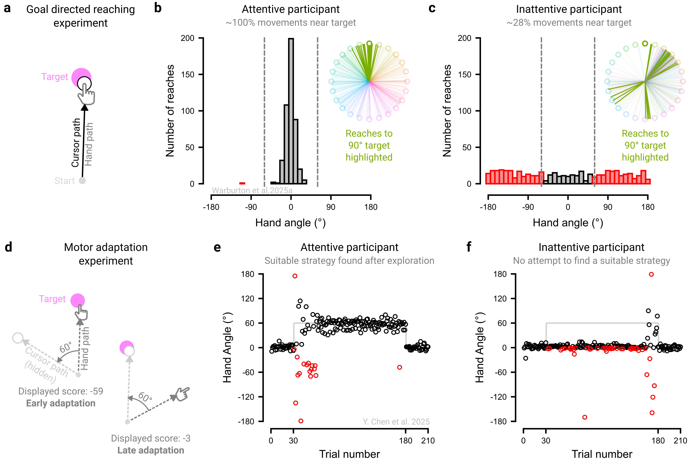

# Plan for behavioral variability {#sec-princ-three}

Online studies can be undermined by low participant engagement or deliberate attempts to “cheat”. These issues are often invisible to the experimenter and can render data unusable. However, there is growing consensus that, when properly managed, online data can rival the quality of laboratory data [@dandurandComparingOnlineLab2008; @germineWebGoodLab2012; @hartshorneThousandStudiesPrice2019; @sauterEqualQualityOnline2022; @semmelmannOnlinePsychophysicsReaction2017].

## Understand and deter the sources of ‘bad data’

Low-quality online data can arise for several reasons. First, participants may misunderstand the task and complete it in unintended ways. For example, participants in a visuomotor rotation experiment may fail to recognize that they should re-aim to counteract the imposed perturbation, and as a result, perseverate in reaching directly toward the target. It is therefore crucial that participants adequately understand the task before starting (see [§ Instruct Clearly](#sec-princ-six) for tips on instructions).

Second, participants may cheat – gaining an unfair advantage through dishonest behavior – for example by writing notes during an online memory assessment. It is therefore crucial to take proactive steps to discourage cheating where it is possible, such as removing performance-based monetary incentives, explicitly defining to participants what behaviors count as dishonest, and using task designs that minimize opportunities for misconduct (e.g., requiring rapid responses that leave little time for external aids).

Third, participants may not be fully attentive to the task. Distractions could range from brief lapses that affect a few trials (e.g., replying to a text message) to prolonged disengagement that affects the whole session (e.g., watching a film). It is therefore crucial to proactively deter these behaviors by making the experiment more engaging or embedding attention checks and catch trials that require an atypical response (see [§ Make it engaging](#sec-princ-seven); see @roddMovingExperimentalPsychology2024 for a thorough treatment of the potential sources of bad data).

### Bots?

Concerns about automated or AI-generated survey responses (‘bots’) have grown alongside advances in artificial intelligence, including large language models [@storozukGotBotsPractical2020; @moss2021bots; @griffinEnsuringSurveyResearch2022; @webbTooGoodBe2022; @goodrichBattlingBotsExperiences2023; @keithTooAnecdotalBe2024; @westwoodPotentialExistentialThreat2025]. At present, bots appear ill-suited to the types of behavioral studies considered here, largely because they struggle to mimic human movement (indeed, idiosyncratic human movement underpin many CAPTCHA tests). Nonetheless, as AI continues to advance, more robust safeguards may be needed to prevent bots from completing behavioral experiments.

## Define and flag bad data

To anticipate how poor data quality may manifest, researchers can complete their own tasks while deliberately mimicking likely failure modes, such as rushing through trials or multitasking, and examine the resulting data patterns. We also recommend recording auxiliary variables that can help detect disengaged behavior. For example, even when response accuracy is the primary dependent measure, recording response time provides an additional indicator of inattentiveness, which may manifest as unusually fast and overly consistent response times.

Clearly defining what constitutes bad data enables targeted tests to identify and remove them; below, we offer several recommendations. First, we recommend flagging bad data via objective criteria – behavioral metrics with predefined thresholds – rather than subjective judgement or visual inspection. For instance, researchers might flag trials as being inattentive where response error exceeds a threshold and exclude participants who surpass a specified proportion of such trials. Second, we recommend defining bad data in terms of absolute thresholds (e.g., where error exceeds a set value) rather than relative ones (e.g., distance from the mean), so that the inattentive participants do not distort the benchmark. Third, when relative criteria are necessary, use robust outlier detection, such as those based on medians and median absolute deviations [@gagneHowRunBehavioural2023; @leysDetectingOutliersNot2013], which are less sensitive to extreme values.

While this can detect many forms of problematic behavior, not all forms can necessarily be detected. For example, while some behavioral signatures of cheating are detectable (e.g., unusually consistent response times, perfect accuracy, or the absence of hallmark behavioral effects), a diligent cheater could intentionally mask these patterns. Therefore, it is crucial to consider how much of a guarantee post-hoc exclusions offer.

## Pre-register exclusion criteria

All exclusion and inclusion criteria should ideally be pre-registered before data collection, that is, publicly specified in advance in a time-stamped record that constrains analytic decisions. Pre-registration constrains researcher degrees of freedom, reducing the risk of spurious findings from questionable research practices (e.g., ‘p-hacking’; @p2021pre). However, it can be difficult to anticipate how bad data may arise, even with extensive pilot testing. As such, researchers may need to deviate from preregistered plans as they collect more data, but any such deviations should be transparently reported [@lakensWhenHowDeviate2024].

## Account for greater variability into a priori power analyses

Online studies often show greater within- and between-subject variability than in-lab samples [@millerComparabilityStabilityReliability2018; @semmelmannOnlinePsychophysicsReaction2017]. While some of this variability reflects welcome sample diversity, it also reduces statistical power to detect effects of interest. To pre-empt this, we recommend conducting conservative power analyses informed by pilot data or meta-analyses to obtain estimates of sample size (see [Box 1](#sec-box-one)).

## The principle in action

We present two experiments that underscore the need to tailor exclusion criteria to the specific demands of each study (@fig-principle-three). In our first experiment, we examined goal-directed motor control by instructing participants to simply move straight through a target, with veridical visual feedback throughout the movement ([@fig-principle-three]a; @warburtonInputDeviceMatters2025). An engaged, instruction-abiding participant would have nearly all their movements fall near the target ([@fig-principle-three]b). In contrast, a disengaged participant might either perseverate in a fixed direction or move in a random manner, with few reaches directed toward the target ([@fig-principle-three]c). Drawing on pilot data, we set a ±60° threshold to flag outlier trials, a conservative criterion chosen to accommodate typical motor variability (≈±10°), and excluded participants who exceeded this threshold on more than 20% of trials.

However, the same exclusion criteria would not be appropriate in contexts where variable, exploratory behavior is expected. In our second experiment, we examined motor adaptation behavior by instructing participants to counteract to a 60° visuomotor rotation, requiring them to deliberately re-aim away from the target ([@fig-principle-three]d; @chenIndirectFeedbackHinders2025). Performance on this task is characterized by pronounced trial-to-trial fluctuations as participants explore and ultimately discover an effective re-aiming strategy to counteract the perturbation ([@fig-principle-three]e; @townsendAhaMomentPrecedes2025; @dingHypothesisTestingGoverns2025). Excluding data based on a simple absolute threshold (e.g., ±60° of fully compensatory movement) would disproportionately remove data from the early exploratory phase, artificially smoothing learning curves and obscuring the very signatures of adaptation [@tsayFundamentalProcessesSensorimotor2024]. Techniques that account for local variability (e.g., sliding windows) and/or complementary metrics (e.g., unusually fast <100 ms or slow >1000 ms reaction times) may better isolate “bad data” arising from attentional lapses.  An inattentive participant would not attempt to identify an appropriate strategy and would instead persist in aiming directly at the target throughout ([@fig-principle-three]f) - behavior that would have appeared attentive in the first experiment. Thus, appropriately identifying problematic data rests on assumptions about what constitutes signal versus noise, assumptions that are often experiment-specific and require subject-matter expertise.

```{r fig-principle-three}
#| fig.align: "center"
#| echo: false
#| fig-cap: "The importance of tailoring inclusion and exclusion criteria to different experiments. (a) In our first example, participants made goal-directed reaching movements to a visual target with veridical feedback. (b) An attentive participant consistently reached to the target, with example reaches to the 90° (upper) target shown in green in the inset panel (different colors denote reaches to different target locations). We operationalized our exclusion criterion as the percentage of reaches falling within ±60° of the target, a conservative criterion chosen to accommodate typical motor variability (≈±10°). (c) An inattentive participant tends to ignore the cued target location, repeatedly reaching toward a single direction or moving randomly. In this example, only 28% of the participant’s reaches fell within ±60° of the target. Bars denote the number of reaches (out of a total of 480), with red bars denoting outlier trials. Data in panels (b) and (c) from @warburtonInputDeviceMatters2025. (d) In our second example, participants performed a visuomotor adaptation experiment in which performance feedback, indexing the magnitude by which a hidden 60°-rotated cursor missed the target, was provided via a numerical score. (e) When the rotation is imposed, yielding low initial scores, an attentive participant typically exhibits exploration early in learning before converging on a successful strategy late in learning. Red points indicate data that would be classified as outliers under the ±60° criteria, which would remove key data points characterizing the exploratory process. (f) Here, inattentive behavior is characterized by a lack of effort to place the rotated cursor on the target, with participants instead aiming directly at the target throughout the experiment. Data in panels (e) and (f) from @chenIndirectFeedbackHinders2025."
#| out.width: 100%


```