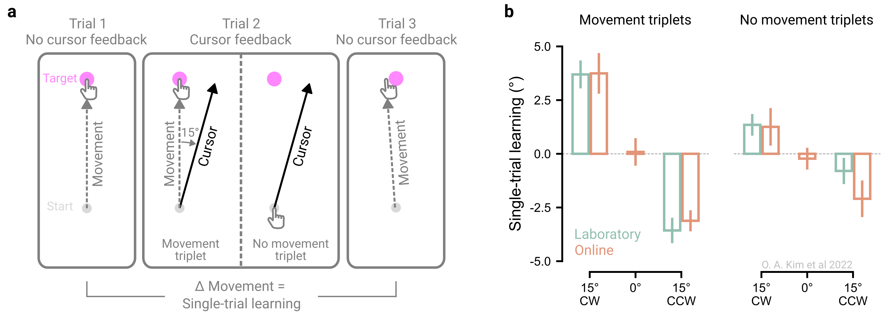

# Validate your experiment {#sec-princ-four}

When launching an online study, researchers often worry whether the experiment will “work” - that is, whether technical or behavioral constraints hinder implementation or whether lab findings generalize to an online format. To address these concerns, we recommend incorporating brief tests that confirm the online task runs as intended and reproduces known effects (‘validation checks’) before extending the basic effect online.

There are several ways to verify whether an experiment works online. One is to replicate a well-established in-person finding in an online format – either by directly reproducing an existing study or by embedding a validation condition that tests whether a known behavioral signature appears in the online setting successful online replications of the classic in-lab effects, such as the Stroop effect, have paved the way for many online extensions [@barnhoornQRTEngineEasySolution2015; @crumpEvaluatingAmazonsMechanical2013]. Another approach is to adopt a hybrid strategy, collecting both in-lab and online data within the same experiment and directly comparing the effect sizes between settings [@dandurandComparingOnlineLab2008; @germineWebGoodLab2012; @sauterEqualQualityOnline2022; @semmelmannOnlinePsychophysicsReaction2017; @uittenhoveLabTestingWebTestingCognitive2023].

However, pinpointing the exact cause for behavioral differences between in-person and online settings can be challenging. Differences in technical setups (e.g., devices and screen refresh rate) and participant characteristics (e.g., demographics and engagement) can all contribute to discrepancies. For instance, the mixed success in replicating masked priming online, with success in some studies [@angeleDoesOnlineMasked2022; @barnhoornQRTEngineEasySolution2015] but not others [@crumpEvaluatingAmazonsMechanical2013], likely reflects differences in experimental design, software, or hardware, given the effect’s dependence on millisecond-level precision. Failures to replicate online may also reflect limitations of the original in-lab studies, requiring researchers to weigh how much time and effort is warranted to identify the cause.

## The principle in action

We have adopted a ‘replicate first’ approach to evaluate the feasibility of conducting motor control experiments online. Movement data collected remotely using a computer mouse or trackpad reliably reproduce several benchmark effects observed in laboratory settings, including the scaling of movement time and movement speed with target distance (“Fitts Law”) and directional reach biases across the angular workspace [@wangOriginMovementBiases2024; @warburtonKinematicMarkersSkill2023], observations that date back at least 60 years [@begbieAccuracyAimingLinear1959; @brownDiscreteMovementsHorizontal1949; @fitts1954information]. Moreover, participants exhibit canonical visuomotor adaptation profiles online [@coltmanSensitivityErrorVisuomotor2021; @tsayMovingOutsideLab2021; @tsayLargescaleCitizenScience2024], along with classic sensorimotor learning phenomena such as savings, anterograde interference, and spontaneous recovery [@jangSoftwareToolAthome2023]. These validation efforts provide confidence in the viability of online studies to study motor control and adaptation.

Others have employed a hybrid approach to test more novel effects, such as one-shot motor learning from withheld movements, by directly comparing performance in the lab and online [@kimMotorLearningMovement2022]. In this experiment, movements across trials were organized into ‘triplets’, where a trial with perturbed visual feedback (15° visuomotor rotation) was flanked by two no-feedback trials. Single trial learning was measured as the change in movement angle between the two flanking no-feedback trials ([@fig-principle-four]a). Additionally, two conditions were tested: a ‘movement’ triplet, in which participants saw rotated cursor feedback relative to their executed movement, and a ‘no-movement’ triplet, in which feedback was referenced to the planned movement because participants were instructed to rapidly inhibit movement execution.

Strikingly, robust one-shot motor learning was observed for both triplet types in both online (computer mouse or trackpad) and laboratory (robotic manipulandum) settings. Learning magnitudes were also strikingly similar across settings ([@fig-principle-four]b). This hybrid approach demonstrated that motor adaptation, whether involving physical movement or not, is robust and generalizable across settings.

```{r fig-principle-four}
#| fig.align: "center"
#| echo: false
#| fig-cap: "Hybrid validation of behavior in online and in-lab settings. (a) To assess one-shot motor learning, trials were organized into ‘triplets’, where a pair of no-feedback trials flanked a trial with perturbed visual feedback (15° visuomotor rotation). There were two triplet conditions: a ‘movement’ triplet, in which participants saw rotated cursor feedback relative to their executed movement, and a ‘no-movement’ triplet, in which feedback was referenced to the planned movement because participants were instructed to rapidly inhibit movement execution. (b) Single-trial learning was evident for both triplet conditions, with comparable learning magnitudes observed across online and laboratory settings. Data from @kimMotorLearningMovement2022."
#| out.width: 100%


```