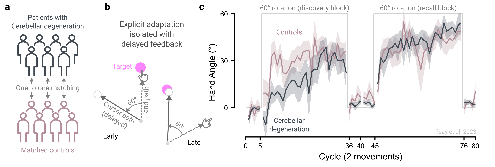

# Recruit participants strategically {#sec-princ-five}

Researchers have many options for collecting data online, each better suited to certain research questions. Below, we outline key considerations for developing a clear recruitment plan tailored to different recruitment goals.

## Choose the most suitable participant pool

### I want data immediately.

Dedicated participant platforms like Prolific and CloudResearch Connect, where participants are financially compensated, are generally the fastest way to recruit. These services provide a steady stream of participants, allowing data collection from hundreds of individuals within mere hours. By contrast, recruitment through citizen science platforms, such as TestMyBrain.org and LabintheWhile.org, or through social media is slower and less predictable [@reineckeLabintheWildConductingLargeScale2015], with studies often staying open for months and participation arriving in bursts via media coverage or outreach efforts [@hiltonWhyMusicPsychology2024].

### I want large sample sizes at minimal costs.

If your goal is to collect large samples at minimal cost, citizen science platforms offer a potential solution. Unlike dedicated participant pools, which require financial compensation, citizen science approaches can generate massive datasets with little to no cost. Instead, participants are rewarded with personalized performance feedback accompanied by explanations of the psychological principles under study [@gajosComputerMouseUse2020; @reineckeLabintheWildConductingLargeScale2015; @tsayLargescaleCitizenScience2024]. The key here is to spark curiosity: draw participants in with an engaging ad, keep tasks brief and fun, and provide meaningful feedback that encourages future participation. Notable examples include Samuel Mehr’s Music Lab ([themusiclab.org](themusiclab.org)), which has attracted millions to discover their “musical IQ” [@liuLanguageExperiencePredicts2023], and “Is My Blue Your Blue?” ([ismy.blue](ismy.blue)), where people learn about their ability to perceive colors.

### I want a diverse sample.

Online samples are typically more diverse and representative than those recruited in traditional laboratory studies [@caseyIntertemporalDifferencesMTurk2017; @douglasDataQualityOnline2023; @paolacciTurkUnderstandingMechanical2014; @peerTurkAlternativePlatforms2017]. Because these platforms have a low barrier to entry – requiring minimal registration or screening, and no need to be co-located with the experimenter – they enable access to wider, more inclusive samples. Prior studies using such approaches have recruited native speakers of 54 languages [@liuLanguageExperiencePredicts2023], participants from 200 countries [@coutrotGlobalDeterminantsNavigation2018], and individuals spanning the human lifespan [@hartshorneWhenDoesCognitive2015].

### I want specific populations.

When targeting specific populations, most recruitment services allow researchers to choose participants based on demographics such as age, gender, profession, or hobbies. Custom screening can also be achieved by administering questionnaires prior to the experiment to identify individuals meeting desired criteria; this enables access to traditionally hard-to-reach groups, such as those with specific (and sometimes rare) disabilities [@smithConvenientSolutionUsing2015]. Citizen science via social media broadens these opportunities further, for example through targeted advertising to specific communities.

For recruiting patient groups, we recommend recruiting directly through clinicians or partnering with established registries. Registries are usually condition-specific, for example among those with Parkinson’s disease [@kimDiagnosticValidationParticipants2018], Cerebral Palsy [@grossCerebralPalsyResearch2020], or those with stroke [@duriskoFlexibleIntegratedSystem2016]. Notably, an advantage of online neuropsychological studies is the ability to recruit tightly matched control participants; each patient can be treated as the reference case, with demographic filters—age, sex/gender, handedness, education, and even device type on platforms like Prolific—used to recruit a one-to-one matched control participant.

However, easier online access to diverse demographics does not guarantee representativeness. Online samples are often skewed toward individuals with higher cognitive abilities, “super-agers,” those curious about online tasks, and those who are more tech-savvy [@ogletreeHowOlderAdults2021; @spiersExplainingWorldWideVariation2023]. And although they tend to be more diverse than the typical college sample, these cohorts remain skewed and WEIRD [@paolacciTurkUnderstandingMechanical2014]. Researchers must, therefore, remain vigilant about these selection biases when interpreting their findings.

## Recruit from reliable participant pools

When using a dedicated participant pool, we recommend selecting a reputable platform and restricting participation to individuals with high approval ratings. While Amazon’s Mechanical Turk has been widely used for behavioral research [@caslerSeparateEqualComparison2013; @crumpEvaluatingAmazonsMechanical2013], there has been a steady decline in data quality on this platform [@chmielewskiMTurkCrisisShifts2020; @kayWhyYouShouldnt2025; @kennedyShapeSolutionsMTurk2020].In contrast, platforms built for research, such as Prolific and CloudResearch Connect, have consistently delivered higher-quality data [@albertComparingAttentionalDisengagement2023; @douglasDataQualityOnline2023; @peerDataQualityPlatforms2021].

## Recruit at consistent times of day

Participant demographics on recruitment platforms can vary by time of day [@caseyIntertemporalDifferencesMTurk2017; @mossStudyDoesTime2019]; compounding this, behavior can also be influenced by daily circadian rhythms and annual academic cycles [@kellerCognitionVariesCalendar2025; @munnilariDiurnalVariationVariables2024; @schmidtTimeThinkCircadian2007]. To minimize this variability, we recommend recruiting participants at consistent times whenever possible, which is often more practical in online compared to in-lab settings.

## Solicit feedback in small batches

When launching an online experiment, start with a small batch of participants and use their written feedback to iteratively improve clarity and usability. For example, if your target sample size is 50, begin with five participants, run quality checks, and refine the study before scaling up. This staggered approach helps catch implementation errors early on, paving the way for a smoother, more polished experiment.

## The principle in action

Decades of laboratory research have shown that patients with cerebellar degeneration are impaired in implicit processes governing motor adaptation [@moreheadCharacteristicsImplicitSensorimotor2017; @tsengSensoryPredictionErrors2007]. That is, patients with cerebellar degeneration exhibit smaller aftereffects than age-matched controls. More recently, the cerebellum has also been implicated in higher-level cognitive functions, such as decision-making, working memory, and numerical cognition, raising the question of whether it also contributes to the explicit re-aiming strategies that underlie motor adaptation (see reviews: @schmahmannCerebellumCognition2019; @tsayCerebellarContributionsAction2025).

To directly test this possibility, we compared patients with cerebellar degeneration to matched controls in an online visuomotor rotation task that isolates explicit re-aiming ([@fig-principle-five]a-b; @tsayCerebellarDegenerationImpairs2023). Online testing removed the logistical barriers of bringing a globally distributed patient cohort into the lab using our patient registry. It also enabled one-to-one matching of patients with controls recruited via Prolific. The results revealed an unexpected dissociation: patients with cerebellar degeneration were impaired at discovering an effective re-aiming strategy early in learnig to counteract the imposed visuomotor rotation but were just as capable as controls at recalling a learned strategy. These online results thus reveal a novel role for the cerebellum in strategy discovery during motor adaptation, consistent with its broader contributions to cognitive function ([@fig-principle-five]c).

```{r fig-principle-five}
#| fig.align: "center"
#| echo: false
#| fig-cap: "Online patient studies leverage the strengths of crowdsourcing. (a) Patients with cerebellar degeneration, recruited from our patient registry, and one-to-one matched controls, recruited from Prolific, were compared on a visuomotor rotation task. (b) Participants were instructed to move to a visual target and received rotated cursor feedback 800 ms after movement termination (defined as exceeding the target distance), a delayed-feedback manipulation known to isolate the explicit processes underlying motor adaptation. (c) Patients with cerebellar degeneration showed a deficit in discovering a strategy but were able to recall a learned one. Data from @tsayCerebellarDegenerationImpairs2023."
#| out.width: 100%


```