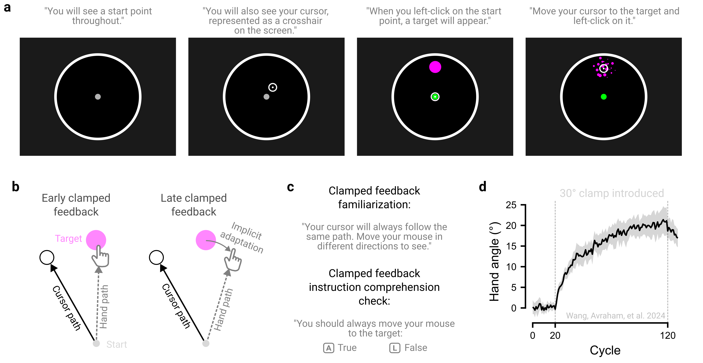

# Instruct clearly {#sec-princ-six}

Unlike in-person studies, where researchers can intervene to clarify confusion, online experiments demand exceptionally clear instructions. While this may seem like a limitation, it can be seen as an advantage, ensuring every participant receives identical information, eliminating subtle instructional differences that go unnoticed in lab settings.

## Check technical requirements up front

Clearly communicate all technical requirements upfront. For example, if the experiment requires participants to wear headphones to hear audible stimuli or to make audio recordings of their responses, this should be stated before the study begins. Further, we recommend explicitly verifying that these requirements are met, such as using a headphone check [see @eerolaOnlineDataCollection2021; @milneOnlineHeadphoneScreening2021 for details] or asking participants to first confirm the quality of their recorded responses before proceeding.

## Make calibration failproof

Where calibration procedures are used as part of the experiment setup (e.g., the credit card procedure), user-friendly guidance is essential. For more unintuitive procedures, a video demonstration may be effective. Importantly, we recommend allowing participants to repeat the calibration procedure to ensure that all parameters are correctly calibrated prior to the start of the session.

## Make instructions digestible

We recommend breaking instructions into small, digestible chunks rather than presenting one overwhelming block of text. This segmented approach improves comprehension and reduces cognitive load. Each instructional chunk should remain on the screen for a minimum duration before participants can advance, a pacing strategy shown to disincentivize inattentiveness [@grantImprovingComprehensionConsent2025]. Visual aids, such as images and videos, can further reinforce how instructions map onto different task components. Brief reminders of the instructions throughout the task are valuable, especially for unintuitive designs or when task goals change.

## Instruct what not to do

We also recommend explicitly instructing participants on what they should not do. Addressing common misunderstandings or counter-productive behaviors reinforces clarity and reduces the risk of poor engagement or cheating. These misunderstandings often emerge during piloting, providing opportunities to refine and iterate on the instructions.

## Check instruction comprehension

Comprehension checks are tools used to verify that participants understand task instructions. They generally follow one of two approaches. First, researchers can embed multiple-choice questions after the instructions to probe understanding [e.g., @crumpEvaluatingAmazonsMechanical2013]. This ensures adequate understanding of the task, as participants can only proceed once the questions are answered correctly, with instructions repeated if necessary. Second, researchers can ask participants to summarize the instructions in their own words [e.g., @peerDataQualityPlatforms2021]. This approach helps to reveal whether participants have a big picture understanding of the task, rather than simply repeating isolated task details. These checks can be evaluated during data analysis and used as inclusion criteria, excluding sessions with clear evidence of misunderstanding.

## Pilot a naïve participant

A simple way to assess instruction clarity is to pilot the task with a naïve participant and then debrief them to identify points of confusion. This process ensures that key stages of the experiment, from calibration to comprehension checks, proceeds intuitively.

## The principle in action

Tutorials in video games offer a blueprint for optimizing experimental instructions. Rather than overwhelming players with instructions all at once, these tutorials deliver piecemeal, on-demand guidance seamlessly integrated into gameplay [@caoLearningPlayUnderstanding2022]. We have applied these principles in some of our experiments [e.g., @warburtonKinematicMarkersSkill2023], gradually introducing stimuli (the cursor, target, and the starting position) and procedures, beginning with simple target-clicking practice and then layering on additional constraints such as time limits ([@fig-principle-six]a).

Clear instructions are critical for our motor learning studies, where task constraints can often seem counterintuitive. For example, in the clamped feedback task used to isolate implicit motor adaptation, participants are instructed to reach straight to the target but ignore a rotated visual cursor that appears at a fixed angular offset (e.g., “clamped” at 30° counterclockwise) from the target ([@fig-principle-six]b; @moreheadCharacteristicsImplicitSensorimotor2017). Because participants are instructed not to aim away from the target, any systematic movement deviation opposite the direction of the cursor rotation can be attributed to implicit processes.

To ensure participants fully understand the instructions, we include a familiarization phase in which they practice moving in different directions under the same cursor rotation, demonstrating that the cursor offset remains invariant ([@fig-principle-six]c). We also embed comprehension checks throughout the experiment, asking participants whether they should move straight to the target or aim away from it; they proceed with the task only after correctly identifying that they must always move straight to the target [@avrahamInterferenceUnderliesAttenuation2025; @kimMotorLearningMovement2022; @tsayMovingOutsideLab2021]. Together, these manipulations ensure that observed learning in this task are not confounded by misunderstandings ([@fig-principle-six]d).

```{r fig-principle-six}
#| fig.align: "center"
#| echo: false
#| fig-cap: "Strategies for providing clear and effective instructions. (a) Piecemeal instructions were delivered through a video game style tutorial, based on the experiments in @warburtonKinematicMarkersSkill2023. The task elements, like the home position, cursor, and target were introduced sequentially. (b) The clamped feedback task (where the cursor always appears at a fixed angular offset from the target, such as 30° counterclockwise, regardless of the participant’s movement direction) is used to isolate implicit processes underlying motor adaptation. Implicit adaptation is indexed by gradual deviations of the hand away from the target in the direction opposite the cursor offset. (c) To ensure that participants fully understood the task, we instructed participants to move toward several different directions to appreciate the cursor’s angular invariance; we also asked participants to answer a comprehension question before allowing them to proceed (for details on instructions, see: @avrahamInterferenceUnderliesAttenuation2025; @kimMotorLearningMovement2022; @tsayMovingOutsideLab2021). (d) Implicit motor adaptation in response to clamped visual feedback. Data from @wangAdvancedFeedbackEnhances2024."
#| out.width: 100%


```