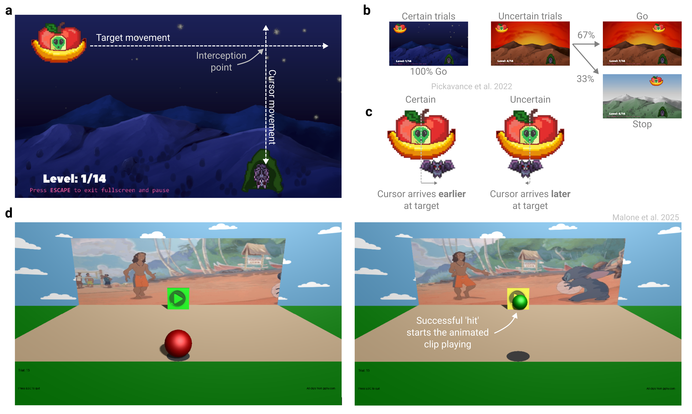

# Make it engaging {#sec-princ-seven}

Task engagement isn’t just a bonus – it is often essential for reducing inattentive responses and sustaining participant motivation. In certain populations, such as children, engagement is a prerequisite for participation. Below, we outline recommendations for maximizing engagement and identifying participants who may not be sufficiently engaged.

## Gamify the experiment

Video games are often designed to maximize enjoyment, offering a valuable blueprint for enhancing engagement in experimental tasks [@allenUsingGamesUnderstand2024]. For example, researchers can incorporate a narrative or cover story [@pickavanceProactiveInhibitionGoaldirected2022], use humorous or attention-grabbing stimuli [@chenAgedependentPavlovianBiases2018], or boost motivation through leaderboards [@hamariDoesGamificationWork2014]. These steps may be particularly beneficial for studies with children [@maloneControlMovementGradually2025] or when running citizen science experiments [@longHowGamesCan2023].

## Bonus payments

Offering a performance-based monetary bonus is a common strategy to boost motivation in online experiments. This can take the form of a small bonus that all participants earn incrementally throughout the task, or a larger reward granted to top performers, such as those ranked highest on a leaderboard. These incentives, however, must be weighed against the risk that participants may be incentivized to cheat to increase their monetary pay-off.

## Regular breaks

Brief and regular breaks allow participants to rest or briefly attend to other matters. This reduces the likelihood of unscheduled pauses or inattentiveness during the task, supporting more consistent engagement and concentrating any rest-induced effects to common periods of the experiment. When uninterrupted engagement is required, we recommend informing participants upfront so they can decide whether to participate and attend to needs (e.g., taking a bathroom break) beforehand.

## Progress Bar

As an experiment continues with no end in sight, the prospects of quitting or rushing through with waning attention become more inviting. A simple remedy is to notify participants of their progress through the experiment with a progress bar shown after each trial or during rest breaks.

## Attention checks

Attention checks help identify participants who are not paying attention. Common approaches in surveys include ‘instructional manipulation checks’ (asking for a specific response that may run counter to intuition), ‘bogus items’ (questions with an obvious answer), repeated questions to test response consistency, and correlations among synonym or antonym items [@newmanDataCollectionOnline2021; @thomasValidityMechanicalTurk2017]. We recommend deploying attention checks at multiple stages of the experiment and integrating them cohesively into the task design.

However, attention checks can change how participants behave—for example, by making them respond more cautiously [@hauserAreManipulationChecks2018; @hauserItsTrapInstructional2015]. Moreover, survey-style attention checks may not be effective in your behavioral tasks, and establishing the validity of new types of attention checks can be challenging. We therefore recommend using attention checks sparingly, where they provide a clear benefit.

## Full screen mode

A simple way to reduce distractions is to require participants to complete the experiment in full-screen mode and only allow participants to proceed while it remains active. It is also beneficial to record how often and how long participants exit from full screen mode to identify those who may be particularly distracted.

## Ask about distractions and level of engagement

A brief post-task questionnaire, asking how much effort participants put in and whether they were distracted (with reassurance that payment is unaffected), can offer valuable insight into how they approached the task. Participants are generally honest when reporting their level of engagement and the nature of their distractions [@ansolabehereDistractionsIncidenceConsequences2015; @drodyDesireDistractionUncovering2023]. These self-reports can be incorporated as covariates in analysis or used as criteria for data exclusion.

## The principle in action

Carefully designing a gamified narrative can make an experiment both more engaging and easier to understand. For example, in a recent study investigating proactive movement inhibition, the ability to withhold an action when a stop signal is expected [@pickavanceProactiveInhibitionGoaldirected2022], researchers designed a simple, easy-to-understand game. Participants controlled a fruit bat using their mouse or trackpad and were instructed to intercept a moving “Unidentified Fruity Object” ([@fig-principle-seven]a). In the ‘certain condition’, a nighttime scene signaled that the bat could safely leave the roost to feed; in the ‘uncertain condition’, a dawn scene sometimes shifted abruptly to daylight, requiring participants to abruptly withhold their movement to avoid “sunburning” bat ([@fig-principle-seven]b). Proactive inhibition was quantified as the delay in movement initiation and target arrival in the uncertain condition relative to the certain condition ([@fig-principle-seven]c). Crucially, the story-based framing made an otherwise abstract manipulation intuitive and engaging.

Tailoring an experiment to the target demographic can also significantly enhance engagement. For example, researchers adapted the visuomotor rotation task for children and adolescents by having participants guide a ball with a mouse to a “play” button, which triggered a short Disney animation as a reward for successfully reaching the target ([@fig-principle-seven]d; @maloneControlMovementGradually2025). This more motivating, age-appropriate task was completed online by hundreds of participants across the lifespan.

```{r fig-principle-seven}
#| fig.align: "center"
#| echo: false
#| fig-cap: "Gamification makes online experiments more intuitive and engaging. (a) Participants used their mouse or trackpad to move a fruit bat from its cave to intercept an ‘Unidentified Fruity Object’ [@pickavanceProactiveInhibitionGoaldirected2022]. (b) The narrative was tightly integrated into the task structure. In the ‘certain condition’, a nighttime scene signaled that the bat could safely leave the roost to feed; in the ‘uncertain condition’, a dawn scene sometimes shifted abruptly to daylight, requiring participants to withhold movement to avoid “sunburning” their bat. (c) Participants showed proactive inhibition under environmental uncertainty, initiating movements and arriving at the target later. The gray line denotes the target’s midline. (d) Tailoring the experiment to the target audience can boost engagement. In a study examining visuomotor adaptation among children [@maloneControlMovementGradually2025], participants guided a ball with their mouse to a “play” button, which then triggered a short Disney animation, serving as a rewarding signal that they had successfully reached the target."
#| out.width: 100%


```