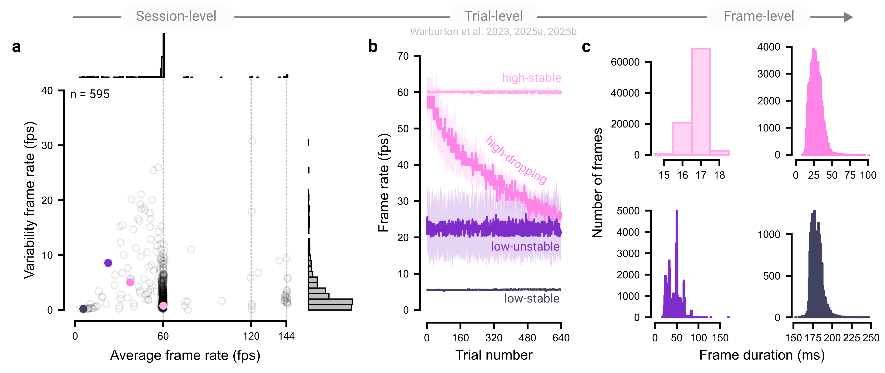

# Collect data comprehensively {#sec-princ-eight}

Detailed documentation of each experimental session is useful for mitigating technical and behavioral variability. Below, we outline implementation tips for recording variables that may aid in ensuring data integrity, diagnosing unexpected patterns, and safeguarding against silent failures in the data pipeline.

## Test a minimal analysis script

Using a minimal analysis script is one of the most effective ways to verify that your experiment is recording data correctly. Run through the experiment yourself, feed the data into the script, and confirm that expected behavioral analyses are produced. Although this step may seem trivial, we have encountered cases where data collection began in earnest only to discover that critical variables were missing, often due to software dependency changes, database upgrades, or data storage limits.

## Collect fixed technological variables

Fixed technological variables, those that remain constant within an experimental session, can be leveraged as covariates or used to pre-screen participants. Broadly, these variables fall into three categories: First, some data can be automatically logged via JavaScript, such as the user’s operating system, web browser, and display resolution [@anwyl-irvineRealisticPrecisionAccuracy2021; @bridgesTimingMegastudyComparing2020]. Second, other details must be self-reported because they are difficult to capture programmatically, such as the type of computer or input device a participant is using. Third, some variables must be measured by the participant. For example, monitor size cannot be reliably inferred automatically and is often unknown to users themselves. In these cases, user-guided measurement methods can be effective – for instance, asking participants to estimate their screen dimensions using a standard credit card as a reference [@liuLanguageExperiencePredicts2023; @yungMethodsTestVisual2015].

## Collect changing technological variables

Some technical variables fluctuate during an experiment. For example, a participant’s display frame rate can vary across the session [@mcconnellMethodologicalConsiderationsBehavioral2024]. Human factors can also drift during an experiment; for example, a blind-spot calibration for viewing distance becomes invalid if a participant shifts their seating position. As such, monitoring these variables and recalibrating frequently are essential for maintaining a controlled experimental setup.

## Seek feedback to improve the experiment

Soliciting participant feedback not only helps participants feel valued in the research process but can also surface issues or insights that improve the experiment. Moreover, asking participants about any strategies they used in the task may reveal unexpected psychological processes and help explain anomalous data patterns. For example, a researcher might struggle to interpret a bimodal pattern in audiovisual psychophysical experiment, only to learn from participant reports that some individuals closed their eyes (an anecdote shared at a conference). Ending with a broad, open-ended question (e.g., “Do you have any additional comments?”) can further surface insights that structured prompts might miss.

## The principle in action

Continuously monitoring technical variables, such as a display’s frame rate, can help identify threats to the integrity of online experiments. Depending on the software implementation and the participant’s hardware, tasks may run at 30 frames per second (fps), well below the nominal 60 fps of standard displays. Such reductions can increase the latency of visual feedback on the screen, a factor known to substantially affect visuomotor performance [@hadjiosifTinyVisualLatencies2025; @smithFeedbackRealTimeDelayed1972]. Moreover, the display rate directly determines temporal resolutions, for example in how closely stimuli display times match their intended durations.

In our experiments, we continuously monitored each participant’s frame rate and used it as a criterion for excluding participants [@warburtonInputDeviceMatters2025; @warburtonKinematicMarkersSkill2023; @warburtonVisuomotorMemoryNot2025]. While most participants exhibited stable frame rates at standard values (e.g., 60, 120, or 144 fps) with minimal trial-to-trial variability ([@fig-principle-eight]a), a subset of participants showed atypical frame rate profiles ([@fig-principle-eight]b). Even within individuals, the distribution of frame durations, the intervals between successive frames, can vary considerably ([@fig-principle-eight]c). Where fine-grained movement analyses were required, we excluded participants with sampling rates below 30 fps, ensuring that our online experiments maintain the temporal precision required for the extraction of valid motor behavior measures.

```{r fig-principle-eight}
#| fig.align: "center"
#| echo: false
#| fig-cap: "Measuring technical variability within and across participants. (a) Each point represents an individual participant, showing the average of their within-trial frame rate and its variability. Four representative participants are highlighted for further visualization. Vertical dashed lines show standard display frame rates. (b) Frame rates for the four highlighted participants exhibit different temporal profiles throughout the experiment. The lines show the median within-trial frame rate, and the shaded region shows the median ± MAD within-trial frame rate. (c) The histograms of frame durations across the whole experiment are shown for the four participants. The data shown come from three published datasets [@warburtonInputDeviceMatters2025; @warburtonKinematicMarkersSkill2023; @warburtonVisuomotorMemoryNot2025]."
#| out.width: 100%


```