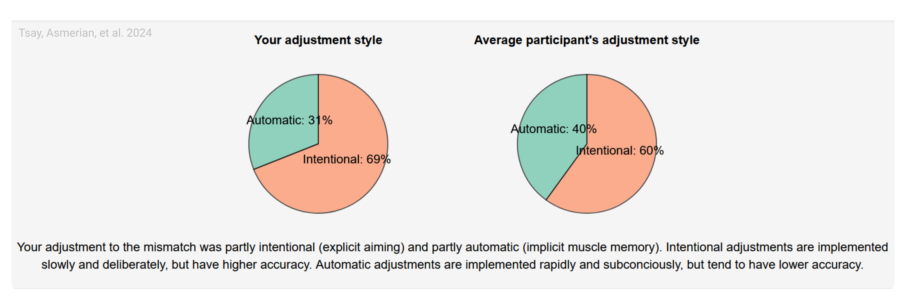

# Respect your participants {#sec-princ-nine}

With no face-to-face interaction, it is easy to forget that real people are completing our online experiments. This disconnect must not breed complacency – providing a positive user experience is essential, and even small design choices can meaningfully enhance both participant experience and data quality [also see: @fowlerFrustrationEnnuiAmazon2023; @kapitanyBestPracticesCrowdsourcing2023].

## Embody the golden rule

Sign up as a participant on a crowdsourcing platform like Prolific, CloudResearch Connect, or Mechanical Turk and try completing a few studies yourself. Even a week or two of casual participation will provide valuable first-hand insight into common frustrations and will help you design a more participant-centered online experiment.

## Be transparent about study demands

While it is often necessary to withhold certain study details, we recommend providing participants with enough information to make an informed decision about their time commitment to the experiment. If a task is likely to be tedious, being upfront about it not only respects participants’ time but can also reduce mid-study dropouts and discourage disengaged participation. Moreover, providing an accurate estimate of experiment duration is both a courtesy on citizen science platforms and a necessity on crowdsourcing platforms, where payment is tied to time. In our experience, median completion times on crowdsourcing websites are typically at least 10% longer than those of well-practiced experimenters. Testing with naïve lab members, friends, or in a small pilot study can help refine these estimates and ensure they reflect the naïve participant’s experience.

## Compensate participants fairly

Participants need to be compensated fairly. On citizen science platforms, this often means non-monetary reward, such as an enjoyable experience, meaningful feedback, or education about the study’s topic. Sometimes gift cards or raffles can also be used as forms of payment. On crowdsourcing platforms, ethical compensation requires providing fair financial rewards commensurate with the time spent—and offering partial compensation even in the event of technical failures. Platforms like Prolific provide clear guidance on recommended pay rates. The harms of exploitative pay in online crowdsourcing have been well documented [e.g., @pittmanAmazonsMechanicalTurk2016], and researchers have a responsibility to respect participants’ time and effort.

Where researchers plan to use exclusion criteria to preclude payment, this must be done in line with a platform’s terms and conditions; moreover, criteria for withholding payment must be clearly stated to participants in advance. Unless bad-faith participation can be clearly distinguished, we recommend researchers err on the side of assuming good-faith participation.

## Debrief participants

Debriefing is often neglected in online studies [@kapitanyBestPracticesCrowdsourcing2023]. We recommend always including at least a brief explanation. Doing so helps participants understand the research goals, feel respected as contributors to science, and may increase their willingness to participate in future studies.

## The principle in action

We gave participants performance feedback in our own motor adaptation work conducted using a citizen-science recruitment approach [@tsayLargescaleCitizenScience2024]. After the experiment, participants were debriefed about their performance, including how effectively they counteracted an imposed visuomotor perturbation through implicit and explicit learning processes. Additionally, they saw how their performance compared with that of their peers ([@fig-principle-nine]b) and were given brief explanations of how these outcome measures were calculated, as well as links to how participants could learn more about the topic. This approach offered participants both insight into their own behavior while fostering a deeper appreciation of the science they were helping to advance [@longHowGamesCan2023]. However, feedback must be delivered with care. We recommend avoiding language that risks leaving participants feeling inadequate or pathologized. For this reason, we framed comparisons positively (e.g., “you performed better than ...” rather than “you performed worse than ...”) and emphasized that performance should not be interpreted as a medical diagnosis. Respectful, constructive feedback is likely to strengthen participants’ trust in the research process.

```{r fig-principle-nine}
#| fig.align: "center"
#| echo: false
#| fig-cap: "Delivering meaningful feedback in online behavioral experiments. In a citizen science motor adaptation experiment [@tsayLargescaleCitizenScience2024], participants received more detailed feedback: a breakdown of their performance into implicit and explicit learning components, comparison with peers, and explanations of how these measures were calculated."
#| out.width: 100%


```